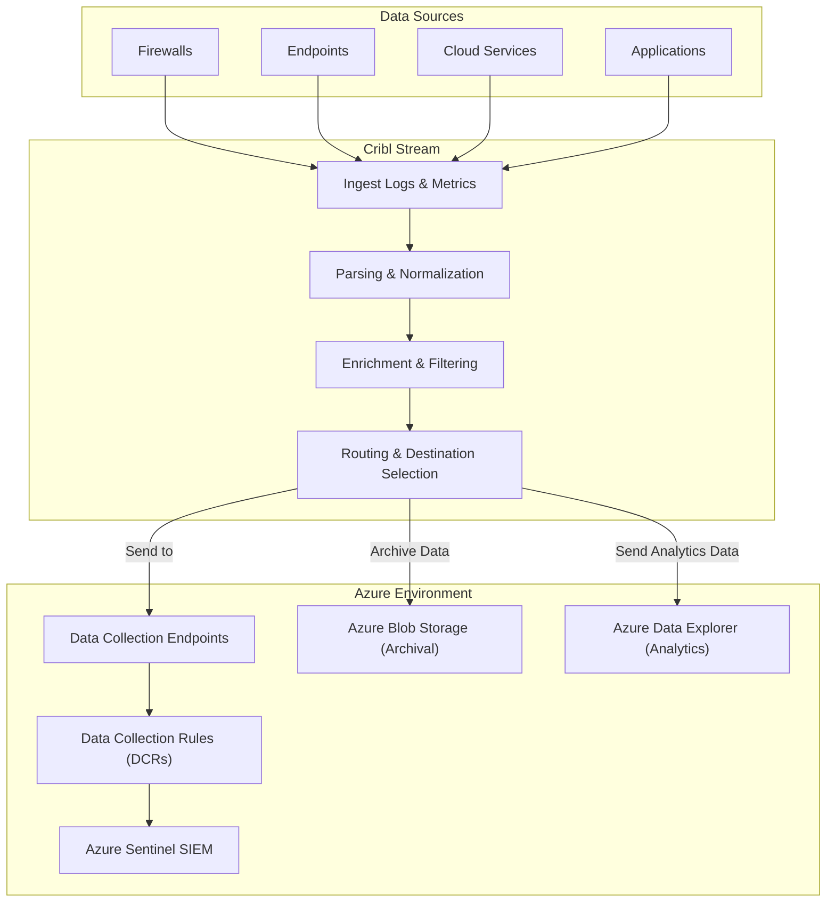

```mermaid
flowchart TD
    subgraph DataSources["Data Sources"]
        fw[Firewalls]
        endpoints[Endpoints]
        cloud[Cloud Services]
        apps[Applications]
    end

    subgraph CriblStream["Cribl Stream"]
        ingest[Ingest Logs & Metrics]
        parse[Parsing & Normalization]
        enrich[Enrichment & Filtering]
        route[Routing & Destination Selection]
    end

    subgraph Azure["Azure Environment"]
        dcr["Data Collection Rules (DCRs)"]
        dce[Data Collection Endpoints]
        sentinel[Azure Sentinel SIEM]
        blob["Azure Blob Storage (Archival)"]
        adx["Azure Data Explorer (Analytics)"]
    end

    fw --> ingest
    endpoints --> ingest
    cloud --> ingest
    apps --> ingest

    ingest --> parse
    parse --> enrich
    enrich --> route

    route -->|Send to| dce
    dce --> dcr
    dcr --> sentinel

    route -->|Archive Data| blob
    route -->|Send Analytics Data| adx
```
